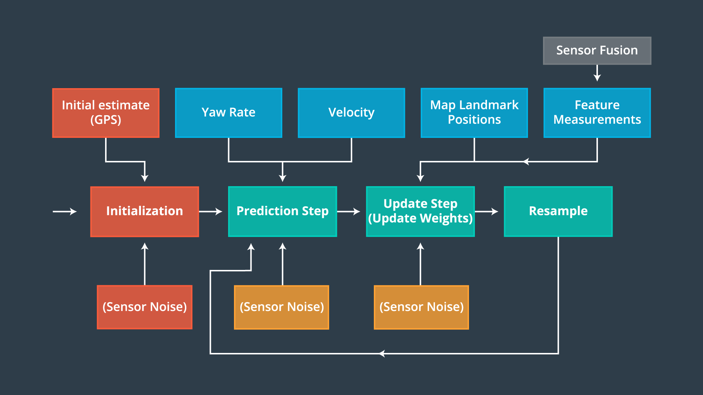

# CarND-Kidnapped-Vehicle-Project

## Project Introduction
The robot has been kidnapped and transported to a new location! Luckily it has a map of this location, a (noisy) GPS estimate of its initial location, and lots of (noisy) sensor and control data.

In this project I implement a 2-dimensional **particle filter** in C++. The particle filter will be given a map and some initial localization information (analogous to what a GPS would provide). At each time step the filter will also get observation and control data.

## Localization Algorithm
Localization, predicing the car location with high accuracy in the range of 3-10 cm, is a key part of self-driving vihecles.

Global Positioning System (GPS), which makes use of triangulation to predict the position of an object detected by multiple satellites, usually provides inaccurate position (1-3 m or worse when signal is weak). To achieve an accuracy of 3-10 cm, sensor information from LIDAR and/or RADAR are used and fused together using a Particle Filter.

### Particle Filter Algorithm Scheme


### Prediction Equations


### Weight Update
The final weight of a particle is the product of probabilities calculated
multivariate gaussian for all observations associated to landmarks.  


### Resampling
```
  // Resample
  double beta = 0.0;
  for (int i = 0; i < num_particles; i++) {
    beta += u_real_dist(gen);
    while (beta > weights[index]) {
      beta -= weights[index];
      index = (index + 1) % num_particles;
    }
    new_particles.push_back(particles[index]);
  }
  particles = new_particles;

```
## Implementing the Particle Filter
The directory structure of this repository is as follows:

```
root
|   build.sh
|   clean.sh
|   CMakeLists.txt
|   README.md
|   run.sh
|
|___data
|   |   
|   |   map_data.txt
|   
|   
|___src
    |   helper_functions.h
    |   main.cpp
    |   map.h
    |   particle_filter.cpp
    |   particle_filter.h
```

## Inputs to the Particle Filter
You can find the inputs to the particle filter in the `data` directory.

#### The Map*
`map_data.txt` includes the position of landmarks (in meters) on an arbitrary Cartesian coordinate system. Each row has three columns
1. x position
2. y position
3. landmark id

### All other data the simulator provides, such as observations and controls.

> * Map data provided by 3D Mapping Solutions GmbH.
## Running the Code
This project involves the Term 2 Simulator which can be downloaded [here](https://github.com/udacity/self-driving-car-sim/releases)

This repository includes two files that can be used to set up and install uWebSocketIO for either Linux or Mac systems. For windows you can use either Docker, VMware, or even Windows 10 Bash on Ubuntu to install uWebSocketIO.

Once the install for uWebSocketIO is complete, the main program can be built and ran by doing the following from the project top directory.

1. mkdir build
2. cd build
3. cmake ..
4. make
5. ./particle_filter

Alternatively some scripts have been included to streamline this process, these can be leveraged by executing the following in the top directory of the project:

1. ./clean.sh
2. ./build.sh
3. ./run.sh

Tips for setting up your environment can be found [here](https://classroom.udacity.com/nanodegrees/nd013/parts/40f38239-66b6-46ec-ae68-03afd8a601c8/modules/0949fca6-b379-42af-a919-ee50aa304e6a/lessons/f758c44c-5e40-4e01-93b5-1a82aa4e044f/concepts/23d376c7-0195-4276-bdf0-e02f1f3c665d)

Note that the programs that need to be written to accomplish the project are src/particle_filter.cpp, and particle_filter.h

The program main.cpp has already been filled out, but feel free to modify it.

Here is the main protocol that main.cpp uses for uWebSocketIO in communicating with the simulator.

INPUT: values provided by the simulator to the c++ program

// sense noisy position data from the simulator

["sense_x"]

["sense_y"]

["sense_theta"]

// get the previous velocity and yaw rate to predict the particle's transitioned state

["previous_velocity"]

["previous_yawrate"]

// receive noisy observation data from the simulator, in a respective list of x/y values

["sense_observations_x"]

["sense_observations_y"]


OUTPUT: values provided by the c++ program to the simulator

// best particle values used for calculating the error evaluation

["best_particle_x"]

["best_particle_y"]

["best_particle_theta"]

//Optional message data used for debugging particle's sensing and associations

// for respective (x,y) sensed positions ID label

["best_particle_associations"]

// for respective (x,y) sensed positions

["best_particle_sense_x"] <= list of sensed x positions

["best_particle_sense_y"] <= list of sensed y positions


